# shimeji-ubuntu

<p align="center">
  
</p>

<p align="center">
  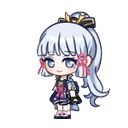
</p>

<p align="center">
  <a href="https://github.com/ngoc-thu/shimeji-ubuntu/releases/latest">⬇ Download latest release</a>
</p>

A practical Ubuntu-focused Shimeji project with:

- reduced flicker experiments for modern compositors
- X11 frame/layer behavior tweaks
- a small Settings GUI
- multi-character switching
- an expanded library of **400+ characters** sourced from [shimejis.xyz](https://shimejis.xyz/directory) (Genshin Impact, Pokémon, Naruto, Undertale, Vocaloid, Marvel, Homestuck, One Piece, etc.)
- live search & real-time character preview in the Settings GUI
- a toggle to enable or disable mascot self-cloning

This project is still based on an old Java/X11 codebase, so it is best treated as a hobby desktop-pet build rather than a perfectly modern desktop integration.

This project includes modified code from an older Shimeji codebase, with Ubuntu/X11-focused usability changes.

## What changed in this project

### 1. Flicker reduction experiment
This project removes an old visibility toggle in `src/com/group_finity/mascot/Mascot.java` that hid the mascot window on specific ticks.

That old behavior can show up as visible blinking/flicker on modern Ubuntu GNOME/X11 compositors.

### 2. Modern build compatibility
`build.xml` was updated so the project can be rebuilt with a current JDK + Ant toolchain instead of requiring an old Java 6 era setup.

### 3. X11 frame and layer behavior tweaks
This project includes experiments around:

- corrected `Rectangle` bounds handling
- `_NET_FRAME_EXTENTS` support for window frame calculations
- more consistent use of frame bounds in X11 environment logic
- disabling old `DOCK` forcing behavior that could place the mascot in an odd stacking layer
- reasserting `alwaysOnTop` / `toFront()` during apply

These changes are specifically aimed at improving behavior on Ubuntu GNOME/X11 where mascots may otherwise flicker, clip into bars, or appear on the wrong layer.

### 4. Built-in Settings GUI with Search & Live Preview
A lightweight GUI settings tool is included:

- `shimeji_settings.py`
- `run-settings.sh`

It can:

- search & filter through **400+ characters** instantly
- preview character images live before applying
- edit `window.conf`
- edit `titles.conf`
- apply a selected character
- enable or disable self-cloning
- restart Shimeji
- open the app folder

### 5. Multi-character switching (400+ Characters)
This project supports a simple character library layout:

```text
characters/
  Ayaka/
  Genshin_Kazuha/
  Miku/
  Naruto_Kakashi/
  Pokemon_Pikachu/
  Undertale_Sans/
  XiaoCatboy/
  ...
```

Each character folder contains `shime1.png` through `shime46.png`.

The Settings GUI allows searching and previewing any character from the 400+ library and applying them into the active `img/` set.

## Included characters

This project now includes **400+ character packs** from [shimejis.xyz](https://shimejis.xyz/directory), spanning popular franchises:

- **Genshin Impact** (Ayaka, Xiao Catboy, Kazuha, Diluc, Hu Tao, Zhongli, Albedo, Childe, Lumine, Aether...)
- **Pokémon** (Pikachu, Eevee, Umbreon, Charizard, Squirtle, Mudkip, Gardevoir...)
- **Naruto** (Naruto, Sasuke, Kakashi, Gaara, Itachi, Hinata...)
- **Undertale** (Sans, Papyrus, Frisk, Chara, Toriel, Undyne...)
- **Vocaloid** (Hatsune Miku, Kagamine Rin/Len, Kaito, Luka...)
- **Marvel / DC & Pop Culture** (Avengers, Spider-Man, Batman, Homestuck, One Piece, etc.)

### Character previews (Full 400+ Library Gallery)

<table>
  <tr>
    <td align="center" width="16%"><br/><sub><b>Adventure Time Beemo</b></sub></td>
    <td align="center" width="16%">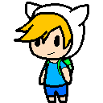<br/><sub><b>Adventure Time Finn</b></sub></td>
    <td align="center" width="16%"><br/><sub><b>Adventure Time Fionna</b></sub></td>
    <td align="center" width="16%"><br/><sub><b>Adventure Time Jake</b></sub></td>
    <td align="center" width="16%">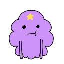<br/><sub><b>Adventure Time Lumpy Space Princess</b></sub></td>
    <td align="center" width="16%"><br/><sub><b>Adventure Time Marceline</b></sub></td>
  </tr>
  <tr>
    <td align="center" width="16%">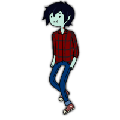<br/><sub><b>Adventure Time Marshall Lee</b></sub></td>
    <td align="center" width="16%">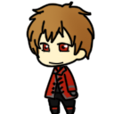<br/><sub><b>Alice In The Country Of Hearts Ace</b></sub></td>
    <td align="center" width="16%">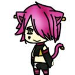<br/><sub><b>Alice In The Country Of Hearts Boris</b></sub></td>
    <td align="center" width="16%">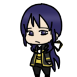<br/><sub><b>Alice In The Country Of Hearts Julius</b></sub></td>
    <td align="center" width="16%">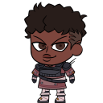<br/><sub><b>Apex Legends Bangalore</b></sub></td>
    <td align="center" width="16%">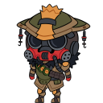<br/><sub><b>Apex Legends Bloodhound</b></sub></td>
  </tr>
  <tr>
    <td align="center" width="16%">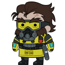<br/><sub><b>Apex Legends Caustic</b></sub></td>
    <td align="center" width="16%">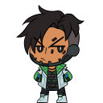<br/><sub><b>Apex Legends Crypto</b></sub></td>
    <td align="center" width="16%">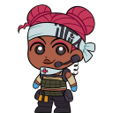<br/><sub><b>Apex Legends Lifeline</b></sub></td>
    <td align="center" width="16%">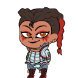<br/><sub><b>Apex Legends Loba</b></sub></td>
    <td align="center" width="16%">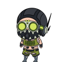<br/><sub><b>Apex Legends Octane</b></sub></td>
    <td align="center" width="16%">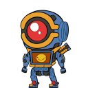<br/><sub><b>Apex Legends Pathfinder</b></sub></td>
  </tr>
  <tr>
    <td align="center" width="16%">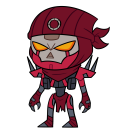<br/><sub><b>Apex Legends Revenant</b></sub></td>
    <td align="center" width="16%">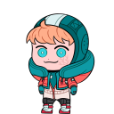<br/><sub><b>Apex Legends Wattson</b></sub></td>
    <td align="center" width="16%">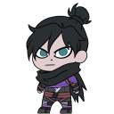<br/><sub><b>Apex Legends Wraith</b></sub></td>
    <td align="center" width="16%"><br/><sub><b>Assassins Creed Cesare</b></sub></td>
    <td align="center" width="16%">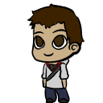<br/><sub><b>Assassins Creed Desmond</b></sub></td>
    <td align="center" width="16%"><br/><sub><b>Assassins Creed Ezio</b></sub></td>
  </tr>
  <tr>
    <td align="center" width="16%">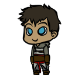<br/><sub><b>Assassins Creed Kadar</b></sub></td>
    <td align="center" width="16%">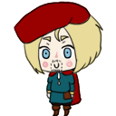<br/><sub><b>Assassins Creed Leonardo Da Vinci</b></sub></td>
    <td align="center" width="16%">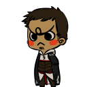<br/><sub><b>Assassins Creed Malik</b></sub></td>
    <td align="center" width="16%"><br/><sub><b>Assassins Creed Yusuf</b></sub></td>
    <td align="center" width="16%">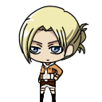<br/><sub><b>Attack On Titan Annie Leonhardt</b></sub></td>
    <td align="center" width="16%">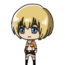<br/><sub><b>Attack On Titan Armin Arlert</b></sub></td>
  </tr>
  <tr>
    <td align="center" width="16%">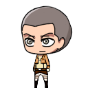<br/><sub><b>Attack On Titan Connie Springer</b></sub></td>
    <td align="center" width="16%"><br/><sub><b>Attack On Titan Eren Jaeger</b></sub></td>
    <td align="center" width="16%"><br/><sub><b>Attack On Titan Hanji Zoe</b></sub></td>
    <td align="center" width="16%"><br/><sub><b>Attack On Titan Jean Kirschtein</b></sub></td>
    <td align="center" width="16%">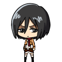<br/><sub><b>Attack On Titan Mikasa Ackerman</b></sub></td>
    <td align="center" width="16%">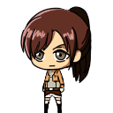<br/><sub><b>Attack On Titan Sasha Braus</b></sub></td>
  </tr>
  <tr>
    <td align="center" width="16%">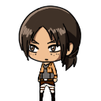<br/><sub><b>Attack On Titan Ymir</b></sub></td>
    <td align="center" width="16%"><br/><sub><b>Ayaka</b></sub></td>
    <td align="center" width="16%">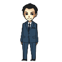<br/><sub><b>Bbc Sherlock Jim Moriarty</b></sub></td>
    <td align="center" width="16%">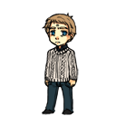<br/><sub><b>Bbc Sherlock John Watson</b></sub></td>
    <td align="center" width="16%">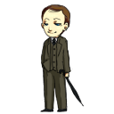<br/><sub><b>Bbc Sherlock Mycroft</b></sub></td>
    <td align="center" width="16%">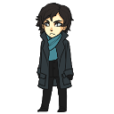<br/><sub><b>Bbc Sherlock Sherlock</b></sub></td>
  </tr>
  <tr>
    <td align="center" width="16%">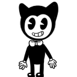<br/><sub><b>Bendy And The Ink Machine Bendy</b></sub></td>
    <td align="center" width="16%"><br/><sub><b>Bioshock Big Daddy</b></sub></td>
    <td align="center" width="16%"><br/><sub><b>Bioshock Fontaine</b></sub></td>
    <td align="center" width="16%">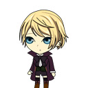<br/><sub><b>Black Butler Alois Trancy</b></sub></td>
    <td align="center" width="16%">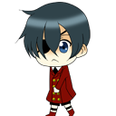<br/><sub><b>Black Butler Ciel Phantomhive</b></sub></td>
    <td align="center" width="16%">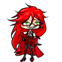<br/><sub><b>Black Butler Grell</b></sub></td>
  </tr>
  <tr>
    <td align="center" width="16%">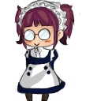<br/><sub><b>Black Butler Maylene</b></sub></td>
    <td align="center" width="16%"><br/><sub><b>Black Butler Sebastian Michaelis</b></sub></td>
    <td align="center" width="16%">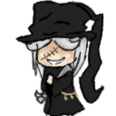<br/><sub><b>Black Butler Undertaker</b></sub></td>
    <td align="center" width="16%"><br/><sub><b>Black Butler William</b></sub></td>
    <td align="center" width="16%"><br/><sub><b>Bleach Aizen</b></sub></td>
    <td align="center" width="16%">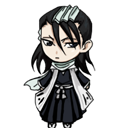<br/><sub><b>Bleach Byakuya Kuchiki</b></sub></td>
  </tr>
  <tr>
    <td align="center" width="16%"><br/><sub><b>Bleach Gin Ichimaru</b></sub></td>
    <td align="center" width="16%">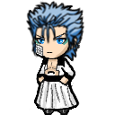<br/><sub><b>Bleach Grimmjow</b></sub></td>
    <td align="center" width="16%">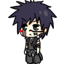<br/><sub><b>Bleach Hisagi Shuuhei</b></sub></td>
    <td align="center" width="16%"><br/><sub><b>Bleach Ichigo</b></sub></td>
    <td align="center" width="16%">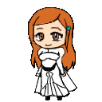<br/><sub><b>Bleach Inoue Orihime</b></sub></td>
    <td align="center" width="16%"><br/><sub><b>Bleach Jushiro Ukitake</b></sub></td>
  </tr>
  <tr>
    <td align="center" width="16%"><br/><sub><b>Bleach Renji Abarai</b></sub></td>
    <td align="center" width="16%">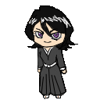<br/><sub><b>Bleach Rukia</b></sub></td>
    <td align="center" width="16%"><br/><sub><b>Bleach Shirosaki Hichigo</b></sub></td>
    <td align="center" width="16%"><br/><sub><b>Bleach Starrk</b></sub></td>
    <td align="center" width="16%"><br/><sub><b>Bleach Szayel Aporro</b></sub></td>
    <td align="center" width="16%">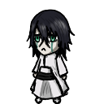<br/><sub><b>Bleach Ulquiorra</b></sub></td>
  </tr>
  <tr>
    <td align="center" width="16%">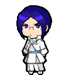<br/><sub><b>Bleach Uryuu Ishida</b></sub></td>
    <td align="center" width="16%">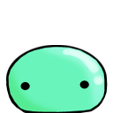<br/><sub><b>Blobs Blob</b></sub></td>
    <td align="center" width="16%"><br/><sub><b>Bts Bangtan Boys J Hope Hobi Hyyh</b></sub></td>
    <td align="center" width="16%">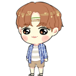<br/><sub><b>Bts Bangtan Boys J Hope Hobi Summer</b></sub></td>
    <td align="center" width="16%"><br/><sub><b>Bts Bangtan Boys Jimin</b></sub></td>
    <td align="center" width="16%">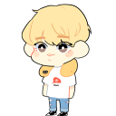<br/><sub><b>Bts Bangtan Boys Jin</b></sub></td>
  </tr>
  <tr>
    <td align="center" width="16%">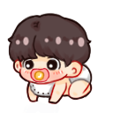<br/><sub><b>Bts Bangtan Boys Jungkook Kookie Baby</b></sub></td>
    <td align="center" width="16%"><br/><sub><b>Bts Bangtan Boys Suga</b></sub></td>
    <td align="center" width="16%"><br/><sub><b>Bts Bangtan Boys V Tae Tae Not Today</b></sub></td>
    <td align="center" width="16%"><br/><sub><b>Bts Bangtan Boys V Tae Tae Puppy</b></sub></td>
    <td align="center" width="16%">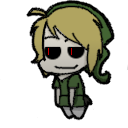<br/><sub><b>Creepypasta Ben Drowned</b></sub></td>
    <td align="center" width="16%"><br/><sub><b>Creepypasta Eyeless Jack</b></sub></td>
  </tr>
  <tr>
    <td align="center" width="16%"><br/><sub><b>Creepypasta Hoody</b></sub></td>
    <td align="center" width="16%"><br/><sub><b>Creepypasta Jeff The Killer</b></sub></td>
    <td align="center" width="16%"><br/><sub><b>Creepypasta Kagekao</b></sub></td>
    <td align="center" width="16%"><br/><sub><b>Creepypasta Laughing Jack</b></sub></td>
    <td align="center" width="16%"><br/><sub><b>Creepypasta Lost Silver</b></sub></td>
    <td align="center" width="16%"><br/><sub><b>Creepypasta Masky</b></sub></td>
  </tr>
  <tr>
    <td align="center" width="16%"><br/><sub><b>Creepypasta Rake</b></sub></td>
    <td align="center" width="16%"><br/><sub><b>Creepypasta Ticci Toby</b></sub></td>
    <td align="center" width="16%"><br/><sub><b>Creepypasta Zehnder</b></sub></td>
    <td align="center" width="16%"><br/><sub><b>Danganronpa Kokichi Oma</b></sub></td>
    <td align="center" width="16%"><br/><sub><b>Deathnote Beyond Birthday</b></sub></td>
    <td align="center" width="16%"><br/><sub><b>Deathnote Matt</b></sub></td>
  </tr>
  <tr>
    <td align="center" width="16%"><br/><sub><b>Digimon Agumon</b></sub></td>
    <td align="center" width="16%"><br/><sub><b>Digimon Culumon</b></sub></td>
    <td align="center" width="16%"><br/><sub><b>Digimon Gatomon</b></sub></td>
    <td align="center" width="16%"><br/><sub><b>Digimon Patamon</b></sub></td>
    <td align="center" width="16%"><br/><sub><b>Digimon Tanemon</b></sub></td>
    <td align="center" width="16%"><br/><sub><b>Digimon Terriemon</b></sub></td>
  </tr>
  <tr>
    <td align="center" width="16%"><br/><sub><b>Disney Movies Ariel And Meg</b></sub></td>
    <td align="center" width="16%"><br/><sub><b>Disney Movies Clopin Trouillefou</b></sub></td>
    <td align="center" width="16%"><br/><sub><b>Disney Movies Flynn Rider</b></sub></td>
    <td align="center" width="16%"><br/><sub><b>Disney Movies Rapunzel Braided Hair</b></sub></td>
    <td align="center" width="16%"><br/><sub><b>Disney Movies Rapunzel Brunette</b></sub></td>
    <td align="center" width="16%"><br/><sub><b>Dragon Ball Z Goku</b></sub></td>
  </tr>
  <tr>
    <td align="center" width="16%"><br/><sub><b>Dragon Ball Z Vegeta</b></sub></td>
    <td align="center" width="16%"><br/><sub><b>Dream Smp Bad Boy Halo</b></sub></td>
    <td align="center" width="16%"><br/><sub><b>Dream Smp Dream</b></sub></td>
    <td align="center" width="16%"><br/><sub><b>Dream Smp Fundy</b></sub></td>
    <td align="center" width="16%"><br/><sub><b>Dream Smp George</b></sub></td>
    <td align="center" width="16%"><br/><sub><b>Dream Smp Ghostbur</b></sub></td>
  </tr>
  <tr>
    <td align="center" width="16%"><br/><sub><b>Dream Smp Ranboo</b></sub></td>
    <td align="center" width="16%"><br/><sub><b>Dream Smp Sapnap</b></sub></td>
    <td align="center" width="16%"><br/><sub><b>Dream Smp Technoblade</b></sub></td>
    <td align="center" width="16%"><br/><sub><b>Durarara Celty Sturluson</b></sub></td>
    <td align="center" width="16%"><br/><sub><b>Durarara Delic Heiwajima</b></sub></td>
    <td align="center" width="16%"><br/><sub><b>Durarara Hachimenroppi Orihara</b></sub></td>
  </tr>
  <tr>
    <td align="center" width="16%"><br/><sub><b>Durarara Hibiya Orihara</b></sub></td>
    <td align="center" width="16%"><br/><sub><b>Durarara Izaya Orihara</b></sub></td>
    <td align="center" width="16%"><br/><sub><b>Durarara Izaya Orihara 05</b></sub></td>
    <td align="center" width="16%"><br/><sub><b>Durarara Izaya Orihara 06</b></sub></td>
    <td align="center" width="16%"><br/><sub><b>Durarara Masaomi Kida</b></sub></td>
    <td align="center" width="16%"><br/><sub><b>Durarara Mikado Ryuugamine</b></sub></td>
  </tr>
  <tr>
    <td align="center" width="16%"><br/><sub><b>Durarara Psyche Orihara</b></sub></td>
    <td align="center" width="16%"><br/><sub><b>Durarara Shinra Kishitani</b></sub></td>
    <td align="center" width="16%"><br/><sub><b>Durarara Shizuo And Izaya</b></sub></td>
    <td align="center" width="16%"><br/><sub><b>Durarara Shizuo Hejiwama</b></sub></td>
    <td align="center" width="16%"><br/><sub><b>Durarara Shizuo Hejiwama 05</b></sub></td>
    <td align="center" width="16%"><br/><sub><b>Durarara Tsugaru Kaikyo Fuyu Geshiki</b></sub></td>
  </tr>
  <tr>
    <td align="center" width="16%"><br/><sub><b>Eddsworld Edd</b></sub></td>
    <td align="center" width="16%"><br/><sub><b>Eddsworld Future Edd</b></sub></td>
    <td align="center" width="16%"><br/><sub><b>Eddsworld Jon</b></sub></td>
    <td align="center" width="16%"><br/><sub><b>Eddsworld Matt</b></sub></td>
    <td align="center" width="16%"><br/><sub><b>Eddsworld Paul</b></sub></td>
    <td align="center" width="16%"><br/><sub><b>Eddsworld Tom</b></sub></td>
  </tr>
  <tr>
    <td align="center" width="16%"><br/><sub><b>Eddsworld Tord</b></sub></td>
    <td align="center" width="16%"><br/><sub><b>Fairy Tail Erza Scarlet</b></sub></td>
    <td align="center" width="16%"><br/><sub><b>Fairy Tail Freed</b></sub></td>
    <td align="center" width="16%"><br/><sub><b>Fairy Tail Jackal</b></sub></td>
    <td align="center" width="16%"><br/><sub><b>Fairy Tail Natsu</b></sub></td>
    <td align="center" width="16%"><br/><sub><b>Fairy Tail Rogue</b></sub></td>
  </tr>
  <tr>
    <td align="center" width="16%"><br/><sub><b>Fairy Tail Sting</b></sub></td>
    <td align="center" width="16%"><br/><sub><b>Fairy Tail Zeref</b></sub></td>
    <td align="center" width="16%"><br/><sub><b>Five Nights At Freddys Chica</b></sub></td>
    <td align="center" width="16%"><br/><sub><b>Five Nights At Freddys Foxy</b></sub></td>
    <td align="center" width="16%"><br/><sub><b>Five Nights At Freddys Mangle</b></sub></td>
    <td align="center" width="16%"><br/><sub><b>Five Nights At Freddys Purple Guy</b></sub></td>
  </tr>
  <tr>
    <td align="center" width="16%"><br/><sub><b>Five Nights At Freddys Pyro Foxy</b></sub></td>
    <td align="center" width="16%"><br/><sub><b>Five Nights At Freddys The Puppet</b></sub></td>
    <td align="center" width="16%"><br/><sub><b>Five Nights At Freddys Toy Bonnie</b></sub></td>
    <td align="center" width="16%"><br/><sub><b>Genshin Impact Aether</b></sub></td>
    <td align="center" width="16%"><br/><sub><b>Genshin Impact Albedo</b></sub></td>
    <td align="center" width="16%"><br/><sub><b>Genshin Impact Ayaka</b></sub></td>
  </tr>
  <tr>
    <td align="center" width="16%"><br/><sub><b>Genshin Impact Childe</b></sub></td>
    <td align="center" width="16%"><br/><sub><b>Genshin Impact Chongyun</b></sub></td>
    <td align="center" width="16%"><br/><sub><b>Genshin Impact Diluc</b></sub></td>
    <td align="center" width="16%"><br/><sub><b>Genshin Impact Hu Tao</b></sub></td>
    <td align="center" width="16%"><br/><sub><b>Genshin Impact Kaeya</b></sub></td>
    <td align="center" width="16%"><br/><sub><b>Genshin Impact Kazuha</b></sub></td>
  </tr>
  <tr>
    <td align="center" width="16%"><br/><sub><b>Genshin Impact Klee</b></sub></td>
    <td align="center" width="16%"><br/><sub><b>Genshin Impact Lumine</b></sub></td>
    <td align="center" width="16%"><br/><sub><b>Genshin Impact Razor</b></sub></td>
    <td align="center" width="16%"><br/><sub><b>Genshin Impact Thoma</b></sub></td>
    <td align="center" width="16%"><br/><sub><b>Genshin Impact Venti</b></sub></td>
    <td align="center" width="16%"><br/><sub><b>Genshin Impact Xiao</b></sub></td>
  </tr>
  <tr>
    <td align="center" width="16%"><br/><sub><b>Genshin Impact Xiao Catboy</b></sub></td>
    <td align="center" width="16%"><br/><sub><b>Genshin Impact Zhongli</b></sub></td>
    <td align="center" width="16%"><br/><sub><b>Gravity Falls Bill Cipher</b></sub></td>
    <td align="center" width="16%"><br/><sub><b>Gravity Falls Mabel Pines</b></sub></td>
    <td align="center" width="16%"><br/><sub><b>Group Finity Blank Guy</b></sub></td>
    <td align="center" width="16%"><br/><sub><b>Hetalia America</b></sub></td>
  </tr>
  <tr>
    <td align="center" width="16%"><br/><sub><b>Hetalia Austria</b></sub></td>
    <td align="center" width="16%"><br/><sub><b>Hetalia Belarus</b></sub></td>
    <td align="center" width="16%"><br/><sub><b>Hetalia Belgium</b></sub></td>
    <td align="center" width="16%"><br/><sub><b>Hetalia Canada</b></sub></td>
    <td align="center" width="16%"><br/><sub><b>Hetalia China</b></sub></td>
    <td align="center" width="16%"><br/><sub><b>Hetalia Denmark</b></sub></td>
  </tr>
  <tr>
    <td align="center" width="16%"><br/><sub><b>Hetalia England</b></sub></td>
    <td align="center" width="16%"><br/><sub><b>Hetalia Estonia</b></sub></td>
    <td align="center" width="16%"><br/><sub><b>Hetalia Finland</b></sub></td>
    <td align="center" width="16%"><br/><sub><b>Hetalia France</b></sub></td>
    <td align="center" width="16%"><br/><sub><b>Hetalia Germany</b></sub></td>
    <td align="center" width="16%"><br/><sub><b>Hetalia Greece</b></sub></td>
  </tr>
  <tr>
    <td align="center" width="16%"><br/><sub><b>Hetalia Hong Kong</b></sub></td>
    <td align="center" width="16%"><br/><sub><b>Hetalia Hre</b></sub></td>
    <td align="center" width="16%"><br/><sub><b>Hetalia Hungary</b></sub></td>
    <td align="center" width="16%"><br/><sub><b>Hetalia Iceland</b></sub></td>
    <td align="center" width="16%"><br/><sub><b>Hetalia Italy</b></sub></td>
    <td align="center" width="16%"><br/><sub><b>Hetalia Japan</b></sub></td>
  </tr>
  <tr>
    <td align="center" width="16%"><br/><sub><b>Hetalia Kugelmugel</b></sub></td>
    <td align="center" width="16%"><br/><sub><b>Hetalia Latvia</b></sub></td>
    <td align="center" width="16%"><br/><sub><b>Hetalia Liechtenstein</b></sub></td>
    <td align="center" width="16%"><br/><sub><b>Hetalia Lithuania</b></sub></td>
    <td align="center" width="16%"><br/><sub><b>Hetalia Netherlands</b></sub></td>
    <td align="center" width="16%"><br/><sub><b>Hetalia Norway</b></sub></td>
  </tr>
  <tr>
    <td align="center" width="16%"><br/><sub><b>Hetalia Poland</b></sub></td>
    <td align="center" width="16%"><br/><sub><b>Hetalia Prussia</b></sub></td>
    <td align="center" width="16%"><br/><sub><b>Hetalia Romano</b></sub></td>
    <td align="center" width="16%"><br/><sub><b>Hetalia Russia</b></sub></td>
    <td align="center" width="16%"><br/><sub><b>Hetalia Scotland</b></sub></td>
    <td align="center" width="16%"><br/><sub><b>Hetalia Sealand</b></sub></td>
  </tr>
  <tr>
    <td align="center" width="16%"><br/><sub><b>Hetalia Seychelles</b></sub></td>
    <td align="center" width="16%"><br/><sub><b>Hetalia South Korea</b></sub></td>
    <td align="center" width="16%"><br/><sub><b>Hetalia Spain</b></sub></td>
    <td align="center" width="16%"><br/><sub><b>Hetalia Sweden</b></sub></td>
    <td align="center" width="16%"><br/><sub><b>Hetalia Switzerland</b></sub></td>
    <td align="center" width="16%"><br/><sub><b>Hetalia Thailand</b></sub></td>
  </tr>
  <tr>
    <td align="center" width="16%"><br/><sub><b>Hetalia Vietnam</b></sub></td>
    <td align="center" width="16%"><br/><sub><b>Homestuck Dave Strider</b></sub></td>
    <td align="center" width="16%"><br/><sub><b>Homestuck Equius</b></sub></td>
    <td align="center" width="16%"><br/><sub><b>Homestuck Eridan</b></sub></td>
    <td align="center" width="16%"><br/><sub><b>Homestuck Feferi</b></sub></td>
    <td align="center" width="16%"><br/><sub><b>Homestuck Gamzee Makara</b></sub></td>
  </tr>
  <tr>
    <td align="center" width="16%"><br/><sub><b>Homestuck Kanaya</b></sub></td>
    <td align="center" width="16%"><br/><sub><b>Homestuck Sollux</b></sub></td>
    <td align="center" width="16%"><br/><sub><b>Homestuck Terezi</b></sub></td>
    <td align="center" width="16%"><br/><sub><b>Homestuck Vriska</b></sub></td>
    <td align="center" width="16%"><br/><sub><b>Hunter X Hunter Killua</b></sub></td>
    <td align="center" width="16%"><br/><sub><b>It 2017 Pennywise</b></sub></td>
  </tr>
  <tr>
    <td align="center" width="16%"><br/><sub><b>Jojos Bizarre Adventure Dio</b></sub></td>
    <td align="center" width="16%"><br/><sub><b>Jojos Bizarre Adventure Kakyoin Noriaki</b></sub></td>
    <td align="center" width="16%"><br/><sub><b>Kingdom Hearts Aqua</b></sub></td>
    <td align="center" width="16%"><br/><sub><b>Kingdom Hearts Axel</b></sub></td>
    <td align="center" width="16%"><br/><sub><b>Kingdom Hearts Demyx</b></sub></td>
    <td align="center" width="16%"><br/><sub><b>Kingdom Hearts Ienzo</b></sub></td>
  </tr>
  <tr>
    <td align="center" width="16%"><br/><sub><b>Kingdom Hearts Riku</b></sub></td>
    <td align="center" width="16%"><br/><sub><b>Kingdom Hearts Roxas</b></sub></td>
    <td align="center" width="16%"><br/><sub><b>Kingdom Hearts Sora</b></sub></td>
    <td align="center" width="16%"><br/><sub><b>Kingdom Hearts Terra</b></sub></td>
    <td align="center" width="16%"><br/><sub><b>Kingdom Hearts Vanitas</b></sub></td>
    <td align="center" width="16%"><br/><sub><b>Kingdom Hearts Xemnas</b></sub></td>
  </tr>
  <tr>
    <td align="center" width="16%"><br/><sub><b>Mario Bowser</b></sub></td>
    <td align="center" width="16%"><br/><sub><b>Mario Luigi</b></sub></td>
    <td align="center" width="16%"><br/><sub><b>Mario Mario</b></sub></td>
    <td align="center" width="16%"><br/><sub><b>Mario Peach</b></sub></td>
    <td align="center" width="16%"><br/><sub><b>Mario Yoshi</b></sub></td>
    <td align="center" width="16%"><br/><sub><b>Miku</b></sub></td>
  </tr>
  <tr>
    <td align="center" width="16%"><br/><sub><b>Miraculous Cat Noir</b></sub></td>
    <td align="center" width="16%"><br/><sub><b>Miraculous Ladybug</b></sub></td>
    <td align="center" width="16%"><br/><sub><b>My Chemical Romance Bob Bryar</b></sub></td>
    <td align="center" width="16%"><br/><sub><b>My Chemical Romance Frank Iero</b></sub></td>
    <td align="center" width="16%"><br/><sub><b>My Chemical Romance Gerard Way</b></sub></td>
    <td align="center" width="16%"><br/><sub><b>My Chemical Romance Mikey Way</b></sub></td>
  </tr>
  <tr>
    <td align="center" width="16%"><br/><sub><b>My Chemical Romance Ray Toro</b></sub></td>
    <td align="center" width="16%"><br/><sub><b>My Hero Academia Katsuki Bakugo Kacchan</b></sub></td>
    <td align="center" width="16%"><br/><sub><b>My Hero Academia Keigo Takami Wing Hero Hawks</b></sub></td>
    <td align="center" width="16%"><br/><sub><b>My Hero Academia Ochako Uraraka Uravity</b></sub></td>
    <td align="center" width="16%"><br/><sub><b>My Hero Academia Shota Aizawa Eraser Head</b></sub></td>
    <td align="center" width="16%"><br/><sub><b>My Hero Academia Tenko Shimura Tomura Shigaraki</b></sub></td>
  </tr>
  <tr>
    <td align="center" width="16%"><br/><sub><b>My Hero Academia Toshinori Yagi All Might</b></sub></td>
    <td align="center" width="16%"><br/><sub><b>Mystic Messenger 707</b></sub></td>
    <td align="center" width="16%"><br/><sub><b>Naruto Deidara</b></sub></td>
    <td align="center" width="16%"><br/><sub><b>Naruto Gaara</b></sub></td>
    <td align="center" width="16%"><br/><sub><b>Naruto Hidan</b></sub></td>
    <td align="center" width="16%"><br/><sub><b>Naruto Hinata</b></sub></td>
  </tr>
  <tr>
    <td align="center" width="16%"><br/><sub><b>Naruto Kakashi</b></sub></td>
    <td align="center" width="16%"><br/><sub><b>Naruto Naruto Uzumaki</b></sub></td>
    <td align="center" width="16%"><br/><sub><b>Naruto Neji</b></sub></td>
    <td align="center" width="16%"><br/><sub><b>Naruto Pein</b></sub></td>
    <td align="center" width="16%"><br/><sub><b>Naruto Sasori</b></sub></td>
    <td align="center" width="16%"><br/><sub><b>Naruto Sasuke</b></sub></td>
  </tr>
  <tr>
    <td align="center" width="16%"><br/><sub><b>Night In The Woods Angus</b></sub></td>
    <td align="center" width="16%"><br/><sub><b>Night In The Woods Bea</b></sub></td>
    <td align="center" width="16%"><br/><sub><b>Night In The Woods Gregg</b></sub></td>
    <td align="center" width="16%"><br/><sub><b>Night In The Woods Mae</b></sub></td>
    <td align="center" width="16%"><br/><sub><b>One Piece Ace</b></sub></td>
    <td align="center" width="16%"><br/><sub><b>One Piece Bepo</b></sub></td>
  </tr>
  <tr>
    <td align="center" width="16%"><br/><sub><b>One Piece Cass</b></sub></td>
    <td align="center" width="16%"><br/><sub><b>One Piece Croc</b></sub></td>
    <td align="center" width="16%"><br/><sub><b>One Piece Dofla</b></sub></td>
    <td align="center" width="16%"><br/><sub><b>One Piece Kidd</b></sub></td>
    <td align="center" width="16%"><br/><sub><b>One Piece Law</b></sub></td>
    <td align="center" width="16%"><br/><sub><b>One Piece Lucci</b></sub></td>
  </tr>
  <tr>
    <td align="center" width="16%"><br/><sub><b>One Piece Luffy</b></sub></td>
    <td align="center" width="16%"><br/><sub><b>One Piece Marco</b></sub></td>
    <td align="center" width="16%"><br/><sub><b>One Piece Mihawk</b></sub></td>
    <td align="center" width="16%"><br/><sub><b>One Piece Zoro</b></sub></td>
    <td align="center" width="16%"><br/><sub><b>One Punch Man Genos</b></sub></td>
    <td align="center" width="16%"><br/><sub><b>One Punch Man Saitama</b></sub></td>
  </tr>
  <tr>
    <td align="center" width="16%"><br/><sub><b>One Punch Man Sonic</b></sub></td>
    <td align="center" width="16%"><br/><sub><b>Osomatsu San Choromatsu Matsuno</b></sub></td>
    <td align="center" width="16%"><br/><sub><b>Osomatsu San Ichimatsu Matsuno</b></sub></td>
    <td align="center" width="16%"><br/><sub><b>Osomatsu San Jyuushimatsu Matsuno</b></sub></td>
    <td align="center" width="16%"><br/><sub><b>Osomatsu San Karamatsu Matsuno</b></sub></td>
    <td align="center" width="16%"><br/><sub><b>Osomatsu San Osomatsu Matsuno</b></sub></td>
  </tr>
  <tr>
    <td align="center" width="16%"><br/><sub><b>Osomatsu San Todomatsu Matsuno</b></sub></td>
    <td align="center" width="16%"><br/><sub><b>Persons Daniel Howell</b></sub></td>
    <td align="center" width="16%"><br/><sub><b>Persons Jacksepticeye</b></sub></td>
    <td align="center" width="16%"><br/><sub><b>Persons Link</b></sub></td>
    <td align="center" width="16%"><br/><sub><b>Persons Markiplier</b></sub></td>
    <td align="center" width="16%"><br/><sub><b>Persons Pew Die Pie</b></sub></td>
  </tr>
  <tr>
    <td align="center" width="16%"><br/><sub><b>Persons Phil Lester</b></sub></td>
    <td align="center" width="16%"><br/><sub><b>Persons Rhett</b></sub></td>
    <td align="center" width="16%"><br/><sub><b>Pokemon Ampharos</b></sub></td>
    <td align="center" width="16%"><br/><sub><b>Pokemon Archen</b></sub></td>
    <td align="center" width="16%"><br/><sub><b>Pokemon Armaldo</b></sub></td>
    <td align="center" width="16%"><br/><sub><b>Pokemon Chandelure</b></sub></td>
  </tr>
  <tr>
    <td align="center" width="16%"><br/><sub><b>Pokemon Charmander</b></sub></td>
    <td align="center" width="16%"><br/><sub><b>Pokemon Clefable</b></sub></td>
    <td align="center" width="16%"><br/><sub><b>Pokemon Crobat</b></sub></td>
    <td align="center" width="16%"><br/><sub><b>Pokemon Cumceon</b></sub></td>
    <td align="center" width="16%"><br/><sub><b>Pokemon Dewott</b></sub></td>
    <td align="center" width="16%"><br/><sub><b>Pokemon Drifloon</b></sub></td>
  </tr>
  <tr>
    <td align="center" width="16%"><br/><sub><b>Pokemon Eevee</b></sub></td>
    <td align="center" width="16%"><br/><sub><b>Pokemon Feraligatr</b></sub></td>
    <td align="center" width="16%"><br/><sub><b>Pokemon Flygon</b></sub></td>
    <td align="center" width="16%"><br/><sub><b>Pokemon Gardevoir</b></sub></td>
    <td align="center" width="16%"><br/><sub><b>Pokemon Gastly</b></sub></td>
    <td align="center" width="16%"><br/><sub><b>Pokemon Jolteon</b></sub></td>
  </tr>
  <tr>
    <td align="center" width="16%"><br/><sub><b>Pokemon Kyurem</b></sub></td>
    <td align="center" width="16%"><br/><sub><b>Pokemon Larvitar</b></sub></td>
    <td align="center" width="16%"><br/><sub><b>Pokemon Litwick</b></sub></td>
    <td align="center" width="16%"><br/><sub><b>Pokemon Mew</b></sub></td>
    <td align="center" width="16%"><br/><sub><b>Pokemon Misdreavus</b></sub></td>
    <td align="center" width="16%"><br/><sub><b>Pokemon Mudkip</b></sub></td>
  </tr>
  <tr>
    <td align="center" width="16%"><br/><sub><b>Pokemon Only Slowpoke</b></sub></td>
    <td align="center" width="16%"><br/><sub><b>Pokemon Oshawott</b></sub></td>
    <td align="center" width="16%"><br/><sub><b>Pokemon Pikachu</b></sub></td>
    <td align="center" width="16%"><br/><sub><b>Pokemon Purrloin</b></sub></td>
    <td align="center" width="16%"><br/><sub><b>Pokemon Raichu</b></sub></td>
    <td align="center" width="16%"><br/><sub><b>Pokemon Reshriram</b></sub></td>
  </tr>
  <tr>
    <td align="center" width="16%"><br/><sub><b>Pokemon Sewaddle</b></sub></td>
    <td align="center" width="16%"><br/><sub><b>Pokemon Shedinja</b></sub></td>
    <td align="center" width="16%"><br/><sub><b>Pokemon Snivy</b></sub></td>
    <td align="center" width="16%"><br/><sub><b>Pokemon Sparker</b></sub></td>
    <td align="center" width="16%"><br/><sub><b>Pokemon Squirtle</b></sub></td>
    <td align="center" width="16%"><br/><sub><b>Pokemon Suicune</b></sub></td>
  </tr>
  <tr>
    <td align="center" width="16%"><br/><sub><b>Pokemon Surfachu</b></sub></td>
    <td align="center" width="16%"><br/><sub><b>Pokemon Swablu</b></sub></td>
    <td align="center" width="16%"><br/><sub><b>Pokemon Tepig</b></sub></td>
    <td align="center" width="16%"><br/><sub><b>Pokemon Togekiss</b></sub></td>
    <td align="center" width="16%"><br/><sub><b>Pokemon Tyranitar</b></sub></td>
    <td align="center" width="16%"><br/><sub><b>Pokemon Umbreon</b></sub></td>
  </tr>
  <tr>
    <td align="center" width="16%"><br/><sub><b>Pokemon Umbreon Shiny</b></sub></td>
    <td align="center" width="16%"><br/><sub><b>Pokemon Zangoose</b></sub></td>
    <td align="center" width="16%"><br/><sub><b>Pokemon Zorua</b></sub></td>
    <td align="center" width="16%"><br/><sub><b>Pokemon Zweilous</b></sub></td>
    <td align="center" width="16%"><br/><sub><b>Pusheen Pusheen The Cat</b></sub></td>
    <td align="center" width="16%"><br/><sub><b>Rick And Morty Rick</b></sub></td>
  </tr>
  <tr>
    <td align="center" width="16%"><br/><sub><b>Sonic Sonic</b></sub></td>
    <td align="center" width="16%"><br/><sub><b>Sonic Tails</b></sub></td>
    <td align="center" width="16%"><br/><sub><b>Sponge Bob Square Pants Sponge Bob</b></sub></td>
    <td align="center" width="16%"><br/><sub><b>Steven Universe Garnet</b></sub></td>
    <td align="center" width="16%"><br/><sub><b>Steven Universe Lapis Lazuli</b></sub></td>
    <td align="center" width="16%"><br/><sub><b>Steven Universe Pearl</b></sub></td>
  </tr>
  <tr>
    <td align="center" width="16%"><br/><sub><b>Steven Universe Peridot</b></sub></td>
    <td align="center" width="16%"><br/><sub><b>Steven Universe Ruby</b></sub></td>
    <td align="center" width="16%"><br/><sub><b>The Avengers Bruce Banner</b></sub></td>
    <td align="center" width="16%"><br/><sub><b>The Avengers Captain America</b></sub></td>
    <td align="center" width="16%"><br/><sub><b>The Avengers Hawkeye</b></sub></td>
    <td align="center" width="16%"><br/><sub><b>The Avengers Loki</b></sub></td>
  </tr>
  <tr>
    <td align="center" width="16%"><br/><sub><b>The Avengers Loki (helmet)</b></sub></td>
    <td align="center" width="16%"><br/><sub><b>The Avengers Tony Stark</b></sub></td>
    <td align="center" width="16%"><br/><sub><b>The Beatles George Harrison</b></sub></td>
    <td align="center" width="16%"><br/><sub><b>The Beatles John Lennon</b></sub></td>
    <td align="center" width="16%"><br/><sub><b>The Beatles Paul Mccartney</b></sub></td>
    <td align="center" width="16%"><br/><sub><b>The Beatles Ringo Starr</b></sub></td>
  </tr>
  <tr>
    <td align="center" width="16%"><br/><sub><b>Tokyo Ghoul Shuu Tsukiyama</b></sub></td>
    <td align="center" width="16%"><br/><sub><b>Undertale Alphys</b></sub></td>
    <td align="center" width="16%"><br/><sub><b>Undertale Asriel</b></sub></td>
    <td align="center" width="16%"><br/><sub><b>Undertale Asylum Sans</b></sub></td>
    <td align="center" width="16%"><br/><sub><b>Undertale Birdtale Sans</b></sub></td>
    <td align="center" width="16%"><br/><sub><b>Undertale Blueberry</b></sub></td>
  </tr>
  <tr>
    <td align="center" width="16%"><br/><sub><b>Undertale Chara</b></sub></td>
    <td align="center" width="16%"><br/><sub><b>Undertale Dreamtale Sans</b></sub></td>
    <td align="center" width="16%"><br/><sub><b>Undertale Dust Sans</b></sub></td>
    <td align="center" width="16%"><br/><sub><b>Undertale Dusty Sansy</b></sub></td>
    <td align="center" width="16%"><br/><sub><b>Undertale Error Sans</b></sub></td>
    <td align="center" width="16%"><br/><sub><b>Undertale Flower Fell Sans</b></sub></td>
  </tr>
  <tr>
    <td align="center" width="16%"><br/><sub><b>Undertale Flowey</b></sub></td>
    <td align="center" width="16%"><br/><sub><b>Undertale Fresh Sans</b></sub></td>
    <td align="center" width="16%"><br/><sub><b>Undertale Frisk</b></sub></td>
    <td align="center" width="16%"><br/><sub><b>Undertale Gaster Sans</b></sub></td>
    <td align="center" width="16%"><br/><sub><b>Undertale Horror Sans</b></sub></td>
    <td align="center" width="16%"><br/><sub><b>Undertale Ink Sans</b></sub></td>
  </tr>
  <tr>
    <td align="center" width="16%"><br/><sub><b>Undertale Napstablook</b></sub></td>
    <td align="center" width="16%"><br/><sub><b>Undertale Nightmare Sans</b></sub></td>
    <td align="center" width="16%"><br/><sub><b>Undertale Papyrus</b></sub></td>
    <td align="center" width="16%"><br/><sub><b>Undertale Reaper Sans</b></sub></td>
    <td align="center" width="16%"><br/><sub><b>Undertale Sans</b></sub></td>
    <td align="center" width="16%"><br/><sub><b>Undertale Soriel</b></sub></td>
  </tr>
  <tr>
    <td align="center" width="16%"><br/><sub><b>Undertale Underfell Sans</b></sub></td>
    <td align="center" width="16%"><br/><sub><b>Undertale Underswap Sans</b></sub></td>
    <td align="center" width="16%"><br/><sub><b>Undertale Undyne</b></sub></td>
    <td align="center" width="16%"><br/><sub><b>Vocaloid Gakupo</b></sub></td>
    <td align="center" width="16%"><br/><sub><b>Vocaloid Hatsune Miku</b></sub></td>
    <td align="center" width="16%"><br/><sub><b>Vocaloid Ia</b></sub></td>
  </tr>
  <tr>
    <td align="center" width="16%"><br/><sub><b>Vocaloid Kagamine Len</b></sub></td>
    <td align="center" width="16%"><br/><sub><b>Vocaloid Kagamine Rin</b></sub></td>
    <td align="center" width="16%"><br/><sub><b>Vocaloid Kaito</b></sub></td>
    <td align="center" width="16%"><br/><sub><b>Vocaloid Luka</b></sub></td>
    <td align="center" width="16%"><br/><sub><b>Vocaloid Mikuo</b></sub></td>
    <td align="center" width="16%"><br/><sub><b>Vocaloid Oliver</b></sub></td>
  </tr>
  <tr>
    <td align="center" width="16%"><br/><sub><b>Voltron Keith</b></sub></td>
    <td align="center" width="16%"><br/><sub><b>Voltron Pidge</b></sub></td>
    <td align="center" width="16%"><br/><sub><b>X Men Deadpool</b></sub></td>
    <td align="center" width="16%"><br/><sub><b>XiaoCatboy</b></sub></td>
    <td align="center" width="16%"><br/><sub><b>Yu Gi Oh Blue Eyes</b></sub></td>
    <td align="center" width="16%"><br/><sub><b>Yu Gi Oh Dark Magician</b></sub></td>
  </tr>
  <tr>
    <td align="center" width="16%"><br/><sub><b>Yu Gi Oh Kiribo</b></sub></td>
    <td align="center" width="16%"><br/><sub><b>Yu Gi Oh New Bakura</b></sub></td>
    <td align="center" width="16%"><br/><sub><b>Yu Gi Oh New Yugi</b></sub></td>
    <td align="center" width="16%"><br/><sub><b>Yu Gi Oh Old Bakura</b></sub></td>
    <td align="center" width="16%"><br/><sub><b>Yu Gi Oh Rex Raptor</b></sub></td>
    <td align="center" width="16%"><br/><sub><b>Yu Gi Oh Seto Kaiba</b></sub></td>
  </tr>
  <tr>
    <td align="center" width="16%"><br/><sub><b>Yu Gi Oh Weevil Underwood</b></sub></td>
    <td align="center" width="16%"><br/><sub><b>Yu Gi Oh Yugi</b></sub></td>
    <td align="center" width="16%"><br/><sub><b>Yuri On Ice Viktor</b></sub></td>
    <td align="center" width="16%"></td>
    <td align="center" width="16%"></td>
    <td align="center" width="16%"></td>
  </tr>
</table>

## Requirements

Recommended environment:

- Ubuntu or another Linux desktop using **X11**
- `openjdk-21-jdk` (or another modern JDK)
- `ant`

Example install:

```bash
sudo apt-get update
sudo apt-get install -y openjdk-21-jdk ant
```

Wayland is not an expected target for this codebase.

## Build

```bash
git clone https://github.com/ngoc-thu/shimeji-ubuntu.git
cd shimeji-ubuntu
ant clean jar
```

## Run

Use the original launcher:

```bash
./launch.sh
```

Or run the jar entrypoint using the local launch wrapper if you created one in your environment.

## Settings GUI

Launch the Settings GUI with:

```bash
./run-settings.sh
```

From there you can:

- choose a character
- apply the selected character
- enable or disable self-cloning
- save window/title configuration
- restart the mascot

The self-cloning toggle is persisted in:

```text
settings.properties
```

Current property used by the app:

```properties
selfCloningEnabled=true
```

## Character switching

The Settings GUI uses the `characters/` directory as the source of truth.

To add a new character manually:

1. create a new folder under `characters/NAME/`
2. place `shime1.png` through `shime46.png` inside it
3. reopen the Settings GUI
4. select that character from the dropdown
5. click **Apply Character** or **Apply + Restart**

## Configuration

### `window.conf`
Controls manual offsets:

1. x offset
2. y offset
3. width add
4. height add

### `titles.conf`
One window title per line. Leave empty to allow interaction with all windows.

### `settings.properties`
Additional runtime behavior flags live here.

Currently supported:

- `selfCloningEnabled=true|false`

## Known limitations

- This is still legacy Java/X11 code.
- Rendering behavior may vary by compositor, theme, GPU, and desktop environment.
- Some Ubuntu GNOME setups may still need manual tuning in `window.conf`.
- Wayland support is not a goal of this project.

## Project intent

This project exists to make it easier to:

- rebuild on a modern Ubuntu machine
- test small targeted fixes
- use a friendlier local settings workflow
- swap characters without manually replacing the image set every time

## License

This project inherits the ZLIB/LIBPNG license of the original Shimeji.

The included Java Native Access library is licensed under the LGPL. The Mozilla Rhino Javascript Engine is licensed under the Mozilla Public License.
